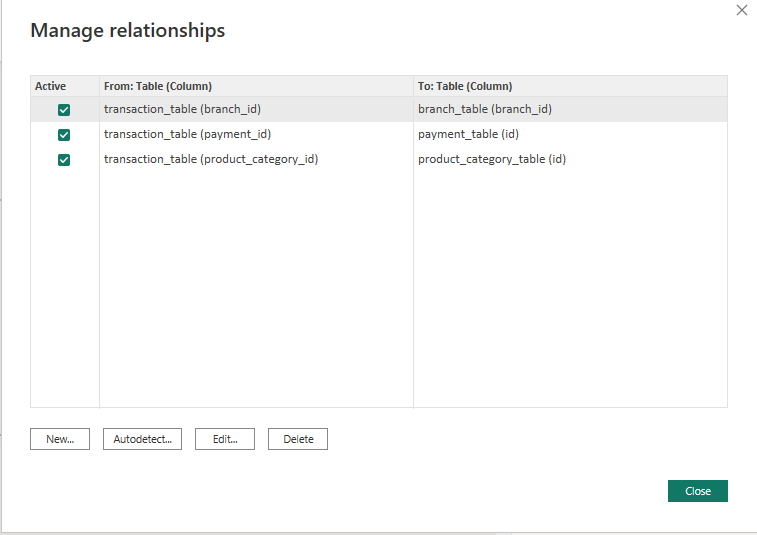
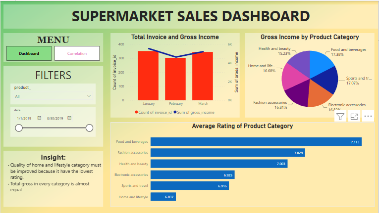
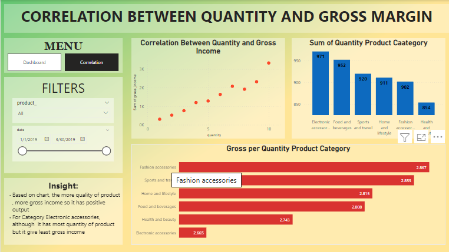

 <a href="https://achmadirfana.github.io/portofolio/portfolio-supermarket.html">Back</a>

<h2> Supermarket Dashboard </h2>

 URL Dashoboard project : <a href="https://app.powerbi.com/view?r=eyJrIjoiZWEzZGFlZTctYjgyMi00M2Y4LTgxMzAtMDhlY2FhNGVkYjk0IiwidCI6ImRmODY3OWNkLWE4MGUtNDVkOC05OWFjLWM4M2VkN2ZmOTVhMCJ9">Supermarket</a>

<h3> Background Project :</h3>

I am a data analyst in a supermarket and my co-partner give a dataset to analyze and presence it to the CEO and manager

<h3>Purpose:</h3>

Make a power BI dashboard and give insight and recomendation. 

<h3>Dataset:</h3>

In this project, it used 1 files excel supermarket_sales_dataset that contain 4 sheet, transaction_table, payment_table,product_category_table,and branch_table 

 Please click this link to look the dataset: <a href="https://docs.google.com/spreadsheets/d/1EMQA-mbT9WaHsyl9ZqNQD6ba1GnjiueX/edit?usp=sharing&ouid=117100138167330558044&rtpof=true&sd=true">supermarket sales dataset</a>

<h3>Dashboard result:</h3>
<h4>Data Manage Relationship</h4>

 
  

<h4>Page Dashboard</h4>

 
  

<h4>Page Correlation</h4>

 
  

<h3>Insight and Recomendation:</h3>

 - Quality of home and lifestyle category must be improved because it have the lowest rating 

 - Total gross in every category is almost equal 

 - Based on chart, the more quantity of product , more gross income so it has positive output 

 - For Category Electronic accessories, although  it has most quantity of product but it give least gross income 

